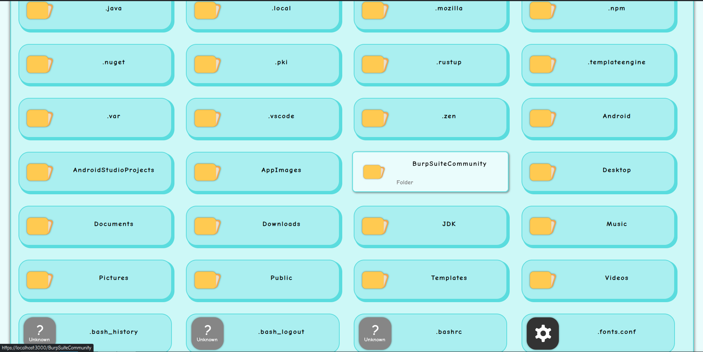

# FileBrowser

A lightweight, zero-dependency file browser for Node.js. Serve and browse your local files securely over HTTP/2 with a clean and simple UI built with nothing but vanilla HTML and CSS.



## ✨ Features

  * **Zero Dependencies:** Built entirely with native Node.js modules. No `node_modules`, no `npm install`.
  * **Unique Visuals:** Features a custom-made SVG icon set for a clean and cohesive look.
  * **Secure by Default:** Uses the native `http2` module to serve content over a secure connection.
  * **Lightweight UI:** A clean and responsive user interface built with pure HTML and CSS. No JavaScript is sent to the client for the UI.
  * **Efficient File Handling:** Uses a custom pre-compiled binary (`read_dir`) for fast directory reading.
  * **Streaming Support:** Natively streams files and supports `Range` requests for partial content, making it great for audio and video playback.
  * **Easy Configuration:** Configure via command-line arguments or a simple `FBrowser.config` file.
  * **Dynamic DNS Support:** Built-in support for Dynu to easily expose your file browser to the internet.
  * **Cross-Platform (WIP):** Designed to work on multiple platforms, with current support focused on Linux.


The goal of FileBrowser is to provide a simple, transparent, and lightweight tool for browsing local files from a remote device. In an ecosystem often heavy with dependencies, this project is an experiment in minimalism, relying solely on the powerful standard libraries provided by Node.js.

## 📋 Requirements

  * **Node.js** (v18.x or newer recommended)
  * **SSL Certificates:** Since the server uses HTTP/2, a `key.pem` and `cert.pem` file are required in the `/Assets` directory.
  * **`read_dir` Binary:** This project uses a pre-compiled binary to list directory contents. The repository currently includes a binary for **Linux only**. Support for other platforms like Windows is planned.

### Generating a Self-Signed Certificate (for local testing)

If you don't have a certificate, you can generate a self-signed one for local development using OpenSSL:

```bash
mkdir -p Assets
openssl req -x509 -newkey rsa:2048 -nodes -sha256 -subj '/CN=localhost' \
  -keyout ./Assets/key.pem -out ./Assets/cert.pem
```

## 🚀 Getting Started

### 1\. Installation

Clone the repository to your local machine:

```bash
git clone https://github.com/your-username/FileBrowser.git
cd FileBrowser
```

### 2\. Permissions (Linux/macOS)

You may need to make the `read_dir` binary executable:

```bash
chmod +x ./Assets/read_dir
```

### 3\. Usage

Run the server with Node.js:

```bash
node .
```

By default, the server will start and serve the current directory on `https://localhost:3000`.

## ⚙️ Configuration

You can configure the server using command-line flags or a configuration file.

### Command-Line Flags

| Flag              | Alias    | Description                                                     | Example                                   |
| ----------------- | -------- | --------------------------------------------------------------- | ----------------------------------------- |
| `--help`          |          | Show the help message.                                          | `node . --help`                           |
| `-f <PATH>`       |          | Path to the folder to host.                                     | `node . -f /home/user/documents`          |
| `-p <PORT>`       |          | The port to host on (default: 3000).                            | `node . -p 8080`                          |
| `-l`              | `-local` | Host on local address only (`::1`).                             | `node . -l`                               |
| `-c <PATH>`       |          | Use a predefined config file.                                   | `node . -c ./my.config`                   |
| `-generate`       |          | Generate a config file in the target folder and exit.           | `node . -f ./shared -generate`            |
| `-d`              | `-dynu`  | Enable updating IP on the Dynu dynamic DNS service.             | `node . -d`                               |
| `-durl <URL>`     |          | Your Dynu hostname.                                             | `node . -durl my-files.dynu.net`          |
| `-dpwd <PASSWORD>`|          | Your Dynu password/hash. (See security note below)              | `node . -dpwd YOUR_HASH`                  |

**Security Note:** For Dynu, it is highly recommended to use the `DYNU_PASSWORD` environment variable instead of the `-dpwd` flag to avoid exposing your password in your command history.

```bash
export DYNU_PASSWORD="YOUR_PASSWORD_HASH"
node . -d -durl your-site.dynu.net
```

### Configuration File (`FBrowser.config`)

You can generate a configuration file to avoid typing flags every time.

1.  **Generate the file:**
    ```bash
    # This will create FBrowser.config in the current directory
    node . -generate
    ```
2.  **Edit the `FBrowser.config` file:**
    ```ini
    folder=./
    useDynu=false
    dynuUrl=
    dynuPassword=
    onlyLocal=false
    port=3000
    ```
3.  **Run the server using the config file:**
    ```bash
    # The server will look for FBrowser.config in the folder it is serving
    node . -f /path/to/your/folder

    # Or specify a config file path directly
    node . -c /path/to/your/FBrowser.config
    ```

## 🗺️ Roadmap

Here is a list of planned features and improvements:

  * [ ] **Cross-Platform Binaries:** Provide pre-compiled `read_dir` binaries for Windows and macOS.
  * [ ] **HTTP Support:** Add an option to run the server over standard HTTP for environments where HTTPS is not needed.
  * [ ] **Asset Auto-Creation:** Automatically generate self-signed certificates if they are not found.
  * [ ] **UI Enhancements:**
      * [ ] Add breadcrumb navigation.
      * [ ] Implement a dark mode.
  * [ ] **Error Handling:** Create custom, user-friendly pages for 404 Not Found and other errors.

## 🤝 Contributing

Contributions are welcome\! If you have ideas for new features, bug fixes, or improvements, please feel free to open an issue or submit a pull request.

